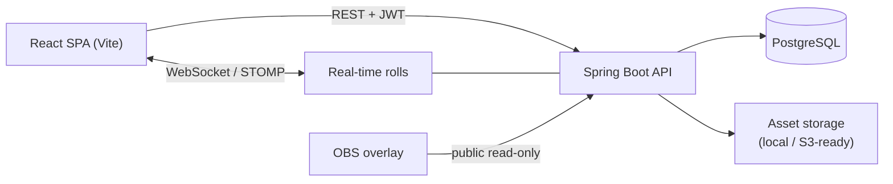

# ASUS RPG Platform

[](https://github.com/Lucas-blip-png/Asus-site/actions/workflows/ci.yml)

Full-stack virtual tabletop (VTT) for tabletop RPGs, built around **ASUS**, a homebrew system with automated character sheets, campaigns and real-time dice rolls.

> 🇧🇷 Versão em português: [README.pt-BR.md](README.pt-BR.md)

<!-- Demo GIF and screenshots coming soon. -->

## Features

- **Automated character sheet** — 7 attributes, 13 races, 16 classes (+ paths), 26 skills and 50 levels; the backend is the single source of truth for every rule (HP/MP/EP, movement, skill bonuses, carrying capacity).
- **Campaigns** with members, invites and per-role permissions (owner, game master, player).
- **Real-time dice rolls** over WebSocket (STOMP): `NdF+M` expressions, critical/fumble, hidden GM rolls.
- **GM screen**, **bestiary**, inventory with the item catalog, abilities, spells and attacks.
- **Audit history and snapshots** of every sheet change, with import/export.
- **LGPD (Brazilian GDPR)**: data export, consent records, account deletion/anonymization.
- **OBS overlay** for streaming sessions, marketplace and sheet templates, plans and usage limits.

## Architecture



In production the React build is bundled into the Spring Boot jar, so API, WebSocket and SPA ship as **one Docker service** on the same origin.

## Tech stack

| Layer | Tech |
|-------|------|
| Back-end | Java 21, Spring Boot 3.3, Spring Data JPA, Spring Security + JWT (jjwt), WebSocket/STOMP, springdoc-openapi |
| Front-end | React, Vite |
| Database | PostgreSQL with Flyway migrations (production), H2 (zero-setup local dev) |
| Tests | JUnit 5, Mockito, MockMvc, Testcontainers (PostgreSQL) |
| Delivery | Docker (multi-stage), GitHub Actions, Railway |

## API documentation

Swagger UI is served at **`/swagger-ui.html`** (OpenAPI spec at `/v3/api-docs`). Log in through `POST /api/auth/login` and use the returned token with the **Authorize** button.

## Running locally

```bash
# Back-end (JDK 21; Maven comes through the wrapper) → http://localhost:8080
cd asus-platform
./mvnw spring-boot:run            # Windows: .\mvnw.cmd spring-boot:run

# Front-end (Node 18+), in another terminal → http://localhost:5173
cd frontend
npm install
npm run dev
```

Dev login: **dev@asus.local / dev12345**. To run against PostgreSQL, activate the `postgres` profile and set `DB_URL`, `DB_USER` and `DB_PASSWORD`.

## Tests

```bash
cd asus-platform
./mvnw verify
```

The suite covers the rules engine, full API flows with MockMvc (sheets, campaigns, rolls, LGPD, marketplace, plans), unit tests for authorization and sheet calculation, and an integration test that boots the whole app — schema and ASUS seed data — on a **real PostgreSQL container** via Testcontainers. Docker must be running for that one.

## Deploy

One Railway service built from the root `Dockerfile` plus a PostgreSQL database. Step by step, environment variables and production checklist in **[DEPLOY.md](DEPLOY.md)** (Portuguese).
